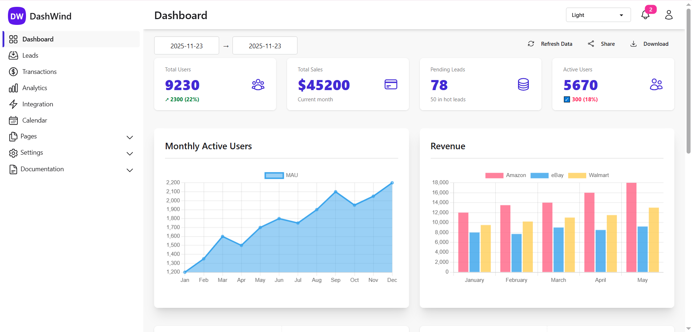

# BrandWind

This is my first open-source project, created as part of a practice module for my university course. It is forked from DashWind, a full-stack, white-label dashboard built with React + Vite on the frontend and Node.js (Express + MongoDB) on the backend.

The project includes authentication, profile management, analytics pages, reusable UI components, and custom theming, along with a new, fully automated branding system that is not present in the original DashWind project. This system enables seamless brand customization and provides a more flexible and scalable foundation for creating uniquely branded dashboards.

I have updated the majority of the dependencies to modern versions, making this project ready to be cloned or forked for use as a production dashboard.

---

## Donations

**You can support my work using this [link](https://ko-fi.com/andreipaulovici)!**

## Preview

[Live preview](https://dash-wind.vercel.app/)



## Features

- **JWT Authentication** (login, register, protected routes)
- **Profile Management** (edit profile, upload profile photo)
- **Dashboard Analytics** (charts, statistics, activity)
- **Data Modules** (Sales, Transactions, Leads, Events)
- **Theme Support** (Light/Dark using DaisyUI)
- **Redux Toolkit** preconfigured
- **Reusable Components** (cards, inputs, tables, modals, alerts)
- **Branding Automation** (one command updates logos, icons, manifest, and app name)

---

## Tech Stack

### Frontend

- React (Vite)
- TailwindCSS + DaisyUI
- Redux Toolkit
- Axios

### Backend

- Node.js / Express
- MongoDB (Local or Atlas)
- JWT Authentication
- Multer (file uploads)

---

## Monorepo Layout

The project contains both the frontend and backend inside one repository:

BrandWind/
frontend/ -> React + Vite application
backend/ -> Express + MongoDB API

---

## Quick Start

### 1. Clone the Project

```bash
git clone https://github.com/PauloviciAndrei/BrandWind.git
cd BrandWind
```

### 2. Install & Run the Frontend

```bash
cd frontend
npm install
npm run dev
```

### 3. Install & Run the Backend (open a new terminal)

```bash
cd ../backend
npm install
npm run dev
```

Frontend default URL:
http://localhost:5173

Backend default URL:
http://localhost:5000

## Environment Variables

### Frontend (.env)

Create a file named `.env` inside the `frontend` folder:

```bash
VITE_BASE_URL=backend_url
```

### Backend (.env)

Create a file named `.env` inside the `backend` folder:

```bash
MONGO_URI=mongodb_uri
PORT=5000
JWT_SECRET=your_secret
JWT_EXPIRES_IN=7d
EMAIL_USER=you@yourmail.com
EMAIL_PASS=password
FRONTEND_URL=your_frontend_url
```

## MongoDB Setup

You can use either **Local MongoDB** or **MongoDB Atlas (Cloud)**.

---

### Local MongoDB

1. Install MongoDB Community Edition:  
   https://www.mongodb.com/try/download/community

2. Start the MongoDB service:

   **Windows (PowerShell):**  
   net start MongoDB

   **macOS (Homebrew):**  
   brew services start mongodb-community

   **Linux (systemd):**  
   sudo systemctl start mongod

3. Use this in your backend `.env` file:

   MONGO_URI=your_mongo_uri

---

## Branding & Rebranding

BrandWind includes an automated branding system that updates the entire application
(app name, icons, logos, manifest, and UI constants) with a single command.

---

### 1. Add Your Logo

Place a square PNG logo in the frontend folder, for example:

frontend/src/assets/logo.png

---

### 2. Edit `branding.config.json`

This file must exist in the `frontend` directory:

```json
{
  "appName": "Your App Name",
  "logoPath": "src/assets/logo.png"
}
```

- `appName`: The name that appears in the UI, browser tab, and PWA manifest
- `logoPath`: Path to your logo relative to the `frontend` folder

---

### 3. Run the Branding Script

From inside the `frontend` folder, run:

npm run brand

This script will:

- Generate favicon and app icons (16×16 → 512×512)
- Update `index.html` with the new title
- Update `manifest.json` with new name and icons
- Update values in `src/utils/branding/branding.js`
- Update logo imports across UI components

---

### 4. Verify the Branding

Run the development server again:

npm run dev

Then check:

- Browser tab title
- App logo in navigation components
- Favicon
- Installed PWA name and icon (if applicable)

---

### Rebranding Later

Simply update `branding.config.json` again and run:

npm run brand

---

## API Notes

BrandWind uses a centralized Axios instance, JWT-based authentication

---

### Axios Instance (Frontend)

All API requests go through a preconfigured Axios instance located in the frontend.

This instance automatically:

- Uses the base URL from `VITE_BASE_URL`
- Adds the JWT token (if present) to every request

### Authentication Notes

- Protected routes require the `Authorization` header:
  Authorization: Bearer <your_jwt_token>

- The backend validates tokens using middleware before allowing access.

---

### Error Handling

The backend responds with JSON error messages in the format:

```json
{
  "message": "Error description here"
}
```

The frontend catches and displays these using its notification system.

---

## Project Structure

Below is the official folder structure for both the frontend and backend.  
This layout ensures clean separation of responsibilities and scalable organization.

---

## Frontend Structure

The frontend is organized by feature and keeps Redux logic, UI components,  
and routing cleanly separated.

frontend/  
 app/ — Redux store setup, authentication state, global configuration  
 components/ — Reusable UI elements (cards, inputs, tables, icons, layout parts)  
 features/ — Feature-specific logic, components, API calls, and Redux slices  
 pages/ — Page-level components used by routes  
 routes/ — All route definitions (public, protected, nested, layouts)  
 assets/ — Static images and icons  
 utils/ — Helper functions (API utilities, branding tools, formatters)  
 branding.config.json — Branding configuration file

---

## Backend Structure

The backend follows a clean layered architecture for maximum maintainability.  
Each layer has its own responsibility: routing → controller → service → repository → model.

backend/  
 config/ — Database config, file upload config (multer), environment setup  
 models/ — Mongoose schemas defining database collections  
 repositories/ — Database operations, aggregations, and MongoDB queries  
 services/ — Business logic, input validation, and application rules  
 controllers/ — Handle requests, responses, and status codes  
 routes/ — API endpoints grouped by feature (auth, users, profile, etc.)  
 middleware/ — JWT authentication, error handlers, request validation  
 uploads/ — Profile images or user-uploaded files

---

This structure enforces clear separation of concerns and makes it easy to extend  
or customize the application for different clients or organizations.

## License

This project is open-source.  
You may modify, distribute, or extend it according to your needs.

## Thank You

Thank you for using BrandWind!  
If you find bugs, need new features, or want to contribute,  
you are welcome to submit issues or pull requests on the GitHub repository.

Happy building! 🚀
